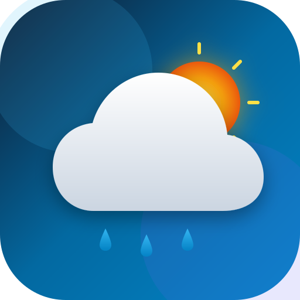

<div align="center">
  
  <h1>Enterprise Weather App PWA</h1>
  <p><strong>Production-Grade, Offline-Capable, Keyless Progressive Web App</strong></p>

  <p>
    <a href="#tech-stack"></a>
    <a href="#tech-stack"></a>
    <a href="#tech-stack"></a>
    <a href="#tech-stack"></a>
    <a href="#tech-stack"></a>
    <a href="#security--standards"></a>
  </p>
</div>

---

## 📋 Executive Overview

**Enterprise Weather App** is a state-of-the-art Progressive Web App (PWA) built with **React 18**, **TypeScript 5**, **Vite 5**, **Zustand 5**, and **Tailwind CSS 3**. Powered by the 100% free **Open-Meteo Weather API**, it delivers hyper-local forecasts worldwide with **zero API keys required**, eliminating client-side secret leakage risks entirely.

Engineered with enterprise design principles:
- **Zero-Scroll Viewport**: Optimized layout fitting standard desktop and laptop viewports seamlessly.
- **Offline-First Architecture**: Consolidated Workbox service worker caching guarantees weather visibility even when disconnected.
- **Zero Cumulative Layout Shift (CLS = 0)**: Precise structural shimmer skeletons eliminate layout jumps during data fetching.
- **Adaptive Dark & Light Glassmorphism**: High-contrast glassmorphic design system with ambient hero mesh grid patterns.
- **Hardened Security Posture**: Audited against OWASP Top 10 & ASVS Level 2 with comprehensive Vercel HTTP security headers and strict CSP.

---

## ✨ Key Features & Innovations

### 🌦️ 100% Free & Keyless Weather Engine
Integrated with **Open-Meteo Geocoding & Forecast APIs** (`https://api.open-meteo.com` & `https://geocoding-api.open-meteo.com`). Allows up to 10,000 free requests per day without requiring API keys, tokens, or secret proxy servers.

### 📱 Consolidated PWA & Offline Support
- **Workbox Caching**: Pre-caches core app assets with automatic runtime lifecycle management.
- **Runtime Expiration Rules**: Enforces explicit TTLs (`maxAgeSeconds: 7200` for forecasts, `604800` for geocoding) preventing stale cache accumulation.
- **Installable**: Full W3C Web App Manifest compliance for native installation on iOS, Android, macOS, and Windows.
- **Auto-Update Lifecycle**: `virtual:pwa-register` ensures immediate background updates without stranding users on stale versions.

### 💡 Actionable Weather Insights Engine
Translates raw meteorological metrics into actionable human advice:
- 👕 **Clothing Recommendation**: Thermal layers vs. light breathable fabrics based on apparent temperature thresholds.
- 🏃 **Outdoor Activity Score**: 1-to-10 outdoor workout index incorporating rain probability, wind speed, and UV metrics.
- 🌧️ **Rain Warning Alert**: Proactive notifications when precipitation probability exceeds 40%.
- ☀️ **Sun Care Advice**: UV index guidance with SPF sunscreen and sunglasses recommendations.

### 📊 Interactive 24-Hour Forecast Breakdown
Custom Recharts visualization with interactive metric tab controls:
- **Temperature Curve (°C / °F)**: Smooth gradient area chart.
- **Rain Probability (%)**: Column bar breakdown.
- **UV Index**: Solar intensity tracking with dynamic tooltips.

### 🎨 Dark & Light Glassmorphism UI
- **Dark Mode**: Midnight obsidian (`#080C14`) backdrop with cyan/indigo radial mesh patterns.
- **Light Mode**: Crisp sky blue (`#E2EBF8`) backdrop with high-contrast slate typography (`#0F172A`).
- **Smooth Theming**: Instant theme toggling persisted safely to `localStorage`.

---

## 🛠️ Project Structure

```
weather_app/
├── public/
│   ├── icon.svg              # Original PWA vector icon
│   ├── favicon.ico           # Legacy fallback favicon
│   ├── manifest.json         # Web App Manifest specification
│   ├── robots.txt
│   └── sw.js                 # Service worker placeholder (generated by VitePWA)
├── src/
│   ├── components/
│   │   ├── Dashboard/
│   │   │   ├── WeatherDetails/
│   │   │   │   └── TodayWeatherDetails.jsx   # 6 Dark glass metric cards
│   │   │   ├── Chart.jsx                     # Recharts 24-hour breakdown
│   │   │   ├── Header.jsx                    # Top header & GPS trigger
│   │   │   └── WeatherSummaryCard.jsx        # Smart Insights cards
│   │   ├── WeatherView/
│   │   │   ├── WeatherLocation.jsx           # City name, date, sunrise/sunset
│   │   │   ├── WeatherSlider.jsx             # Temperature hero & 7-day forecast
│   │   │   └── WeatherViewHeader.jsx         # Searchbar & °C/°F switcher
│   │   ├── ErrorBoundary.tsx                 # React error boundary wrapper
│   │   ├── SearchModal.jsx                   # City search modal with GPS button
│   │   └── WeatherIcon.jsx                   # Animated Lucide weather icon
│   ├── context/
│   │   └── WeatherContext.tsx                # Context provider wrapper
│   ├── services/
│   │   ├── weatherService.ts                 # Typed Open-Meteo API client
│   │   └── weatherInsights.ts                # Actionable advice engine
│   ├── store/
│   │   └── useWeatherStore.ts                # Typed Zustand store
│   ├── types/
│   │   └── weather.ts                        # TypeScript interfaces & contracts
│   ├── vite-env.d.ts                         # Vite & PWA type declarations
│   ├── App.jsx                               # Root application component
│   ├── index.css                             # Glassmorphism & design system tokens
│   ├── index.jsx                             # Application entry point
│   ├── registerServiceWorker.js              # PWA service worker registration
│   └── reportWebVitals.jsx                   # Web Vitals performance telemetry
├── .eslintrc.cjs                             # ESLint React + TS + Accessibility rules
├── .gitignore                                # Secure environment & build exclusions
├── .prettierrc                               # Code style formatting rules
├── index.html                                # Root HTML5 entry point
├── package.json                              # Dependencies & scripts
├── pnpm-lock.yaml                            # Deterministic package lockfile
├── tailwind.config.cjs                       # Tailwind CSS & DaisyUI theme configuration
├── tsconfig.json                             # Strict TypeScript configuration
├── vercel.json                               # Vercel deployment & security headers
└── vite.config.ts                            # Vite 5 build pipeline & Workbox config
```

---

## 🚀 Getting Started

### Prerequisites
- **Node.js**: `>= 18.0.0`
- **Package Manager**: `pnpm` (`>= 8.0.0` recommended)

### 1. Installation
```bash
git clone https://github.com/MdMuzahid07/Weather_APP_ReactJS.git
cd Weather_APP_ReactJS
pnpm install
```

### 2. Development Server
Start the local development server with Vite Hot Module Replacement (HMR):
```bash
pnpm dev
```
Navigate to `http://localhost:5173/` in your browser.

### 3. Type Checking & Code Quality
```bash
# Type check TypeScript codebase
pnpm typecheck

# Run ESLint (React Hooks, TypeScript & Accessibility rules)
pnpm lint
```

### 4. Production Build & Deployment Preview
```bash
# Compile TypeScript & bundle production assets
pnpm build

# Preview production build locally
pnpm preview
```

---

## 🔒 Security & Standards Compliance

The application has undergone security verification against **OWASP Top 10 (2021)** and **OWASP ASVS Level 2**:

1. **HTTP Security Headers (`vercel.json`)**:
   - `Content-Security-Policy`: Restricts script/connect sources strictly to `'self'` and Open-Meteo API endpoints (`https://api.open-meteo.com`, `https://geocoding-api.open-meteo.com`).
   - `X-Frame-Options: DENY`: Prevents clickjacking and framing attacks.
   - `X-Content-Type-Options: nosniff`: Mitigates MIME-sniffing vulnerabilities.
   - `Referrer-Policy: strict-origin-when-cross-origin`: Controls referrer leakage.
   - `Permissions-Policy`: Restricts camera, microphone, and payment APIs; allows `geolocation=(self)`.
2. **Zero Secrets / Keyless Architecture**: No API keys, tokens, or credentials are hardcoded or embedded in client bundles.
3. **Client-Side Injection (XSS) Prevention**: Zero usage of `dangerouslySetInnerHTML`, `innerHTML`, or `eval`. Input queries are sanitized with regex and URI encoding.
4. **Volatile Geolocation Handling**: User coordinates retrieved via `navigator.geolocation` are kept in runtime Zustand memory only and never persisted to storage or third-party servers.
5. **Supply Chain Hygiene**: Test harnesses isolated in `devDependencies`; production sourcemaps disabled (`sourcemap: false`).

---

## ♿ Accessibility (WCAG 2.1 AA)

- **Keyboard Navigation**: Full keyboard navigation support with focus indicator rings.
- **Screen Reader Support**: Semantic HTML5 hierarchy with ARIA labels (`aria-label`, `role="tablist"`, `role="dialog"`).
- **Motion Safety**: CSS animations adhere to `motion-safe` rules respecting user OS `prefers-reduced-motion` settings.

---

## 📄 License & Credits

This project is open-source under the MIT License.
- Weather data provided by [Open-Meteo API](https://open-meteo.com/) (Free Tier 10,000 calls/day).
- Icons provided by [Lucide React](https://lucide.dev/).
