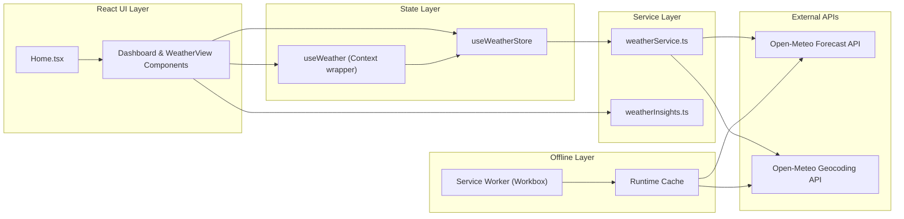
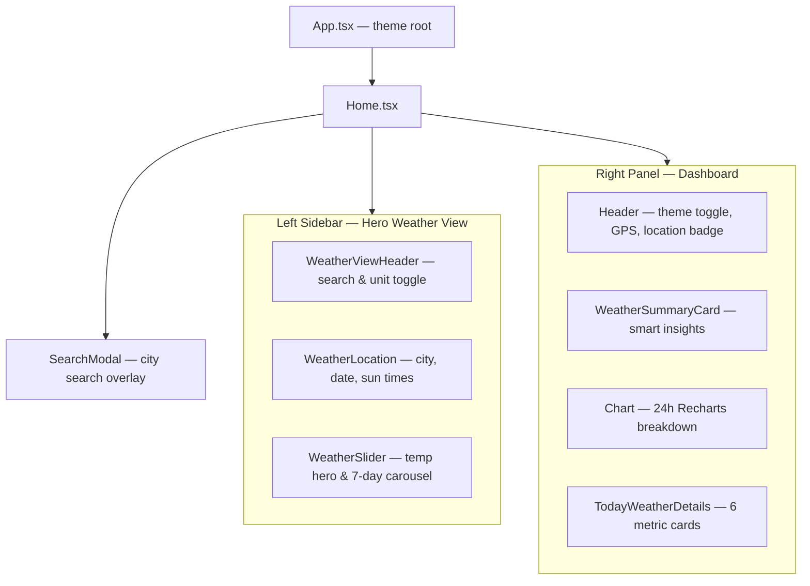

<div align="center">

# Weather App

**A production-ready Progressive Web App for live weather forecasts — powered by Open-Meteo, built with React 18 and TypeScript.**

[](https://react.dev/)
[](https://www.typescriptlang.org/)
[](https://vitejs.dev/)
[](https://tailwindcss.com/)
[](https://web.dev/progressive-web-apps/)
[](https://opensource.org/licenses/MIT)

[Features](#features) · [Architecture](#architecture) · [Getting Started](#getting-started) · [Deployment](#deployment) · [Security](#security)

</div>

---

## Overview

Weather App is a fully client-side weather dashboard that delivers real-time forecasts, actionable daily insights, and an installable PWA experience — **without API keys or backend infrastructure**.

The application integrates directly with the [Open-Meteo Forecast](https://open-meteo.com/en/docs) and [Geocoding](https://open-meteo.com/en/docs/geocoding-api) APIs. Data is fetched in the browser, normalized into typed domain models, and rendered through a glassmorphic UI with dark/light themes, skeleton loading states, and offline-aware caching.

| Design goal | Implementation |
|---|---|
| Zero API keys | Direct Open-Meteo integration from the client |
| Type safety | Strict TypeScript across the entire `src/` tree |
| Offline resilience | Workbox service worker + runtime API caching |
| Performance | Code-split vendor bundles, gzip/brotli compression |
| Security | CSP and hardened HTTP headers via `vercel.json` |

---

## Features

### Weather & Location

- **Current conditions** — temperature, feels-like, humidity, wind, precipitation, UV index, rain probability, sunrise/sunset
- **7-day daily forecast** — swipeable carousel with WMO weather codes mapped to Lucide icons
- **24-hour breakdown** — interactive Recharts chart with temperature, rain probability, and UV tabs
- **City search** — debounced geocoding lookup with popular-city shortcuts
- **GPS location** — browser geolocation with permission handling
- **Unit toggle** — °C / °F with automatic refetch and localized wind/precipitation units

### Smart Daily Insights

The `weatherInsights` engine converts raw metrics into human-readable guidance:

| Insight | Logic |
|---|---|
| Clothing | Thermal layer recommendations based on apparent temperature |
| Outdoor Index | 1–10 score factoring rain, wind, and extreme temperatures |
| Rain Warning | Triggered when rain probability ≥ 40% or precipitation is detected |
| Sun Care | SPF and UV protection advice based on UV index thresholds |

### UI & UX

- **Glassmorphism design system** — ambient mesh gradients, backdrop blur panels, theme-aware cards
- **Dark & light themes** — persisted to `localStorage` under `weather_theme`
- **Shimmer skeletons** — zero layout shift during data fetching
- **Responsive layout** — split hero sidebar + scrollable dashboard; optimized for desktop and mobile viewports
- **Error boundary component** — reusable widget-level recovery UI (`ErrorBoundary.tsx`)

### Progressive Web App

- Installable on iOS, Android, macOS, and Windows
- Auto-updating service worker via `vite-plugin-pwa`
- Pre-cached static assets with explicit runtime cache TTLs for API responses
- Automatic refetch when the browser comes back online

---

## Architecture

### High-Level Data Flow



### Application Layout



### State Management

Global state is managed by **Zustand** (`src/store/useWeatherStore.ts`) with a fully typed `WeatherStoreState` contract defined in `src/types/weather.ts`.

| State slice | Description |
|---|---|
| `location` | Active city coordinates and display name |
| `unit` | Temperature unit (`C` \| `F`) |
| `theme` | UI theme (`dark` \| `light`), persisted to `localStorage` |
| `weatherData` | Normalized `ProcessedWeatherData` from the API layer |
| `loading` / `error` | Fetch lifecycle flags |
| `isSearchOpen` | Search modal visibility |
| `isOffline` | Network status, synced via `online` / `offline` events |

`WeatherContext.tsx` exposes a `useWeather()` hook that delegates to the Zustand store — used by `SearchModal` for a context-based consumption pattern.

### API Layer

`src/services/weatherService.ts` handles all external communication:

| Function | Endpoint | Timeout | Notes |
|---|---|---|---|
| `fetchWeatherData(lat, lon, unit)` | `api.open-meteo.com/v1/forecast` | 10s | Returns current, hourly (24h), and daily (7d) data |
| `searchCities(query)` | `geocoding-api.open-meteo.com/v1/search` | 8s | Min 2 chars; input sanitized; returns up to 6 results |
| `getWeatherCondition(code)` | — | — | Maps WMO weather codes to icon, label, and color |

All fetch calls use `AbortController` for timeout protection. Search queries are trimmed and stripped of `<` / `>` characters before encoding.

---

## Tech Stack

| Category | Technology | Purpose |
|---|---|---|
| Framework | React 18 | UI rendering with Strict Mode |
| Language | TypeScript 5 (strict) | End-to-end type safety |
| Build tool | Vite 5 | Dev server, HMR, production bundling |
| Styling | Tailwind CSS 3 + DaisyUI | Utility-first CSS and toggle components |
| State | Zustand 5 | Lightweight global store |
| Charts | Recharts 2 | 24-hour forecast visualization |
| Icons | Lucide React | Weather and UI iconography |
| Carousel | Nuka Carousel 8 | 7-day forecast slider |
| PWA | vite-plugin-pwa + Workbox | Service worker, manifest, runtime caching |
| Compression | vite-plugin-compression | Gzip + Brotli asset compression |
| Linting | ESLint + TypeScript ESLint + jsx-a11y | Code quality and accessibility rules |
| Formatting | Prettier | Consistent code style |
| Deployment | Vercel | Static hosting with security headers |

---

## Project Structure

```
free-weather/
├── public/
│   ├── icon.svg                 # PWA app icon (SVG)
│   ├── hero-landscape.svg       # Hero sidebar background
│   ├── manifest.json            # Web App Manifest
│   ├── robots.txt
│   └── sw.js                    # Service worker placeholder (generated at build)
├── src/
│   ├── components/
│   │   ├── Dashboard/
│   │   │   ├── Chart.tsx                    # 24-hour Recharts breakdown
│   │   │   ├── Header.tsx                   # Dashboard header, theme & GPS controls
│   │   │   ├── WeatherSummaryCard.tsx       # Smart insights cards
│   │   │   └── WeatherDetails/
│   │   │       └── TodayWeatherDetails.tsx  # Six detailed metric cards
│   │   ├── WeatherView/
│   │   │   ├── WeatherLocation.tsx          # City, date, sunrise/sunset
│   │   │   ├── WeatherSlider.tsx            # Temperature hero & 7-day carousel
│   │   │   └── WeatherViewHeader.tsx        # Search trigger & °C/°F toggle
│   │   ├── ErrorBoundary.tsx                # React error boundary
│   │   ├── SearchModal.tsx                  # City search modal with GPS
│   │   └── WeatherIcon.tsx                  # WMO code → Lucide icon mapper
│   ├── context/
│   │   └── WeatherContext.tsx               # Zustand store context wrapper
│   ├── pages/
│   │   └── Home.tsx                         # Main layout orchestrator
│   ├── services/
│   │   ├── weatherService.ts                # Open-Meteo API client
│   │   └── weatherInsights.ts               # Actionable advice engine
│   ├── store/
│   │   └── useWeatherStore.ts               # Zustand global store
│   ├── types/
│   │   └── weather.ts                       # Domain types & store contracts
│   ├── App.tsx                              # Root component & theme shell
│   ├── App.test.tsx                         # Smoke test (excluded from tsc)
│   ├── index.tsx                            # Application entry point
│   ├── index.css                            # Design system & theme tokens
│   ├── registerServiceWorker.ts             # PWA registration
│   ├── reportWebVitals.ts                   # Web Vitals telemetry hook
│   ├── setupTests.ts                        # Testing Library setup
│   └── vite-env.d.ts                        # Vite & PWA type declarations
├── .env.example                             # Optional environment overrides
├── .eslintrc.cjs                            # ESLint configuration
├── .prettierrc                              # Prettier configuration
├── index.html                               # HTML entry point
├── package.json
├── tailwind.config.cjs                      # Tailwind + DaisyUI theme
├── tsconfig.json                            # Strict TypeScript config
├── vercel.json                              # Deployment & security headers
└── vite.config.ts                           # Vite, PWA, and build configuration
```

---

## Getting Started

### Prerequisites

| Requirement | Version |
|---|---|
| Node.js | ≥ 18.0.0 |
| pnpm | ≥ 8.0.0 (recommended) |

npm and yarn also work; examples below use pnpm.

### Installation

```bash
git clone https://github.com/MdMuzahid07/Weather_APP_ReactJS.git
cd Weather_APP_ReactJS
pnpm install
```

### Development

```bash
pnpm dev
```

Open [http://localhost:5173](http://localhost:5173). Vite provides hot module replacement (HMR) for instant feedback during development.

### Environment Variables

No API keys are required. Copy the example file if you want to override defaults:

```bash
cp .env.example .env
```

| Variable | Default | Description |
|---|---|---|
| `VITE_APP_TITLE` | `Weather App - Live Open-Meteo Forecasts` | Document title override |
| `VITE_OPEN_METEO_FORECAST_URL` | `https://api.open-meteo.com/v1/forecast` | Forecast API base URL |
| `VITE_OPEN_METEO_GEOCODING_URL` | `https://geocoding-api.open-meteo.com/v1/search` | Geocoding API base URL |

> **Note:** API URLs are currently hardcoded in `weatherService.ts`. Environment variables in `.env.example` are reserved for future configurability.

### Available Scripts

| Command | Description |
|---|---|
| `pnpm dev` | Start Vite dev server |
| `pnpm start` | Alias for `pnpm dev` |
| `pnpm build` | Type-check with `tsc`, then produce optimized production bundle |
| `pnpm preview` | Serve the production build locally |
| `pnpm typecheck` | Run TypeScript compiler without emitting files |
| `pnpm lint` | Lint all `.ts` / `.tsx` files in `src/` |

### Production Build

```bash
pnpm build
pnpm preview   # optional — verify the build locally
```

Build output is written to `dist/`. Key build optimizations configured in `vite.config.ts`:

- **Target:** ES2022
- **Minification:** esbuild
- **Source maps:** disabled in production
- **Manual chunks:** `vendor-react`, `vendor-recharts`, `vendor-lucide`, `vendor-state`
- **Compression:** gzip (`.gz`) and brotli (`.br`) sidecar files

---

## Deployment

### Vercel (Recommended)

The repository includes a `vercel.json` configured for Vite:

```bash
# Install Vercel CLI (optional)
pnpm add -g vercel

# Deploy
vercel --prod
```

Vercel settings (also defined in `vercel.json`):

| Setting | Value |
|---|---|
| Framework | Vite |
| Build command | `pnpm build` |
| Output directory | `dist` |
| SPA routing | All routes rewrite to `/index.html` |

### Other Static Hosts

Any static file host works (Netlify, Cloudflare Pages, GitHub Pages with SPA fallback, AWS S3 + CloudFront):

1. Run `pnpm build`
2. Upload the contents of `dist/`
3. Configure SPA fallback to `index.html`
4. Apply equivalent security headers (see [Security](#security))

---

## PWA & Offline Behavior

### Service Worker Strategy

Configured in `vite.config.ts` via `vite-plugin-pwa`:

| Resource | Strategy | Cache name | TTL |
|---|---|---|---|
| App shell (JS, CSS, HTML, icons) | Precache | Workbox precache | Build hash |
| Forecast API | Network First (5s timeout) | `open-meteo-forecast-cache` | 2 hours, max 30 entries |
| Geocoding API | Stale While Revalidate | `open-meteo-geocoding-cache` | 7 days, max 50 entries |

Registration is handled in `src/registerServiceWorker.ts` using `virtual:pwa-register` with `registerType: 'autoUpdate'`.

### Installability

The Web App Manifest (`public/manifest.json`) defines:

- **Display mode:** `standalone`
- **Theme color:** `#080C14`
- **Categories:** `weather`, `utilities`
- **Icons:** SVG with `any` and `maskable` purposes

### Network Recovery

When connectivity is restored, the Zustand store listens for the browser `online` event and automatically triggers `fetchWeather()`.

---

## Security

### HTTP Security Headers

Production deployments on Vercel apply the following headers (defined in `vercel.json`):

| Header | Value | Purpose |
|---|---|---|
| `Content-Security-Policy` | Restricts scripts, styles, and connections to `'self'` and Open-Meteo domains | XSS and data exfiltration mitigation |
| `X-Frame-Options` | `DENY` | Clickjacking prevention |
| `X-Content-Type-Options` | `nosniff` | MIME sniffing prevention |
| `Referrer-Policy` | `strict-origin-when-cross-origin` | Referrer leakage control |
| `Permissions-Policy` | `geolocation=(self)` | Restricts browser feature access |

Static assets under `/assets/` are served with `Cache-Control: public, max-age=31536000, immutable`.

### Application Security Practices

- **No secrets in client bundle** — Open-Meteo free tier requires no API keys
- **Input sanitization** — Geocoding queries are trimmed and stripped of angle brackets before URL encoding
- **No unsafe HTML rendering** — no usage of `dangerouslySetInnerHTML`, `innerHTML`, or `eval`
- **Geolocation privacy** — coordinates are held in runtime memory only; never persisted to storage or sent to third parties
- **Fetch timeouts** — all API calls abort after 8–10 seconds via `AbortController`
- **Environment isolation** — `.env*` files are gitignored; only `.env.example` is tracked

---

## Performance

| Optimization | Detail |
|---|---|
| Code splitting | Vendor libraries isolated into separate chunks |
| Asset compression | Gzip and Brotli generated at build time |
| Skeleton loading | Shimmer placeholders prevent cumulative layout shift |
| Selective re-renders | Zustand selectors minimize unnecessary component updates |
| Lazy API timeouts | Failed requests abort cleanly without hanging the UI |
| Font loading | Plus Jakarta Sans loaded via Google Fonts with `display=swap` |

Optional Web Vitals reporting is available via `reportWebVitals.ts` (not wired by default in `index.tsx`).

---

## Accessibility

The project extends ESLint with `eslint-plugin-jsx-a11y` and follows these patterns:

- Semantic HTML structure with descriptive button titles
- Keyboard-accessible interactive controls
- Focus-visible styling on form inputs and toggles
- `motion-safe:` prefixes on decorative animations (respects `prefers-reduced-motion`)
- Sufficient color contrast in both dark and light themes

---

## Browser Support

| Browser | Minimum version |
|---|---|
| Chrome / Edge | 90+ |
| Firefox | 90+ |
| Safari | 15+ |
| Mobile Safari / Chrome | Latest two major versions |

Requires ES2022, `fetch`, `AbortController`, Service Workers (for PWA features), and `navigator.geolocation` (for GPS).

---

## Development Guidelines

### Code Style

- **TypeScript strict mode** is enforced — no `.js` / `.jsx` files in `src/`
- **Prettier** config: single quotes, 2-space indent, 100-char print width
- **Imports:** use extensionless paths; Vite resolves `.tsx` / `.ts` automatically
- **Components:** co-locate by feature (`Dashboard/`, `WeatherView/`)

### Adding a New Weather Metric

1. Extend the Open-Meteo query in `weatherService.ts`
2. Add fields to `CurrentWeatherData` in `types/weather.ts`
3. Map the raw API value in `fetchWeatherData()`
4. Render in `TodayWeatherDetails.tsx` or `Chart.tsx`

### Linting & Type Checking

Run both before opening a pull request:

```bash
pnpm typecheck
pnpm lint
```

---

## Troubleshooting

<details>
<summary><strong>Build fails with "Cannot find module lodash/throttle"</strong></summary>

Recharts depends on lodash internally. Ensure it is installed:

```bash
pnpm add lodash
```

</details>

<details>
<summary><strong>Geolocation returns an error</strong></summary>

- Ensure the site is served over HTTPS (required by browsers except `localhost`)
- Check that location permission is granted in browser settings
- Verify `Permissions-Policy` allows `geolocation=(self)` on your host

</details>

<details>
<summary><strong>Stale weather data after going offline</strong></summary>

Forecast data is cached for up to 2 hours via Workbox. When back online, the app automatically refetches. You can also toggle °C/°F or change location to force a refresh.

</details>

<details>
<summary><strong>PWA not updating to latest version</strong></summary>

The service worker uses `autoUpdate`. Hard-refresh or close and reopen the installed app. On Vercel, ensure `/sw.js` is served with `Cache-Control: no-cache` (configured in `vercel.json`).

</details>

---

## Acknowledgments

- Weather data by [Open-Meteo](https://open-meteo.com/) — free, open-source weather API (10,000 requests/day non-commercial tier)
- Icons by [Lucide](https://lucide.dev/)
- Typography: [Plus Jakarta Sans](https://fonts.google.com/specimen/Plus+Jakarta+Sans) by Tokotype

---

## License

This project is open source under the [MIT License](https://opensource.org/licenses/MIT).

---

<div align="center">

Built with React, TypeScript, and Open-Meteo

**[Report an issue](https://github.com/MdMuzahid07/Weather_APP_ReactJS/issues)** · **[View repository](https://github.com/MdMuzahid07/Weather_APP_ReactJS)**

</div>
